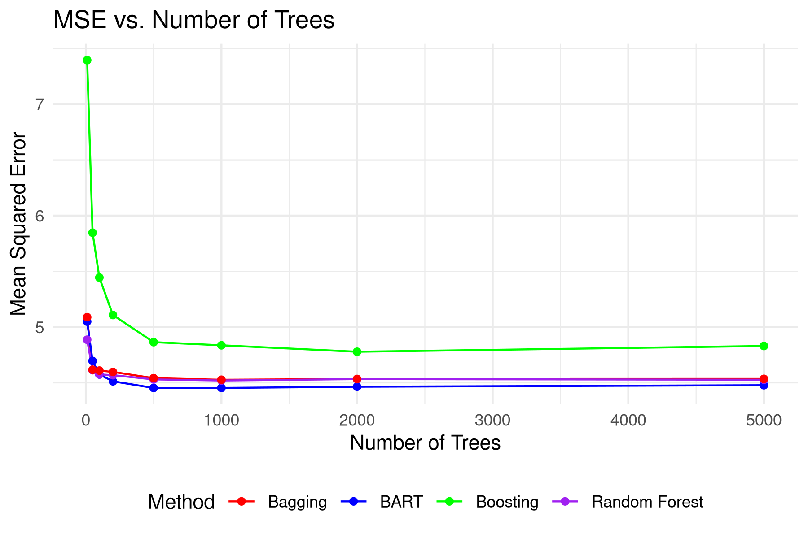

# BART Project

This repository contains the code and the paper for the project "BART: A Comparison with Frequentist Tree Methods". This project was part of the course "Bayesian Statistical Methods" at Bocconi University.

## Authors

- [Vincenzo Dorrello](https://github.com/MarescialloLannes)
- [Giulio Frey](https://github.com/giuliofrey)
- [Guido Rossetti](https://github.com/g-rossetti)
- [Giovanni Scarpato](https://github.com/giovanniscarpato)

## Abstract

This paper provides a comparison between Bayesian Additive Regression Trees (BART) and traditional non-Bayesian tree-based methods for regression problems. We begin by examining the theoretical foundations of decision trees. We then turn to frequentist ensemble methods, including bagging, random forests, and boosting. Finally, we introduce BART, a Bayesian nonparametric approach that combines the flexibility of regression trees with the formal uncertainty quantification of Bayesian inference. The paper details BART's likelihood, regularization prior, and the Bayesian backfitting MCMC algorithm used for posterior inference. Our final section is a data application, in which we compare the predictive performance of BART against other ensemble methods through both simulated and real-world data. In particular, using the UCI Abalone dataset, we show that BART achieves superior prediction accuracy compared to random forests, boosting, and bagging when using sufficient numbers of trees, though at a higher computational cost. Overall, our findings suggest that BART's automatic prior-based regularization and ability to quantify uncertainty is particularly well suited for complex non-linear modeling tasks.

## Contents

- `code/`: contains the code and the dataset used in the analysis
- `outputs/`: contains the outputs of the code
- `paper/`: contains the paper in PDF and TeX format
